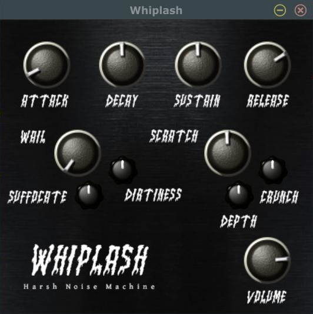

# Whiplash
Whiplash is a harsh noise synthesizer with various distortion effects intended to be used in harsh noise, power electronics, and other industrial music projects.

## Table of Contents

---
* [Installation](#installation)
* [Filters overview](#filters-overview)
* [Filters in-depth](#filters-in-depth)
* [Asset Credits](#asset-credits)
* [License](#license)

## Installation

---
[Back to top](#table-of-contents)

Download the VST3 version of the `.zip` or `.tar.gz` archive from the [latest release](https://github.com/KedarPanchal/whiplash/releases/latest) on GitHub. Extract the archive into a folder and move the extracted folder to the following location based on your operating system:

* Windows: `C:\Program Files\Common Files\VST3`
* MacOS/OS X: `Library/Audio/Plug-ins/VST3`

Afterward, fire up your DAW and re-scan for plugins to make sure Whiplash shows up.

## Filters Overview

---
[Back to top](#table-of-contents)

* The `Attack`, `Decay`, `Sustain`, and `Release` filters provide a standard ADSR envelope that most other synths have.
* `Wail` increases the resonance of the sound, creating a wailing effect when increased.
* The `Volume` filter changes the output gain of the synthesizer.
* The `Depth` filter transposes the pitch of the synth one octave down or one octave up.
* The remainder of the filters apply various distortion effects that can change the texture of the noise when used in tandem with one another and the other filters described above.
  
## Filters In-Depth

---
[Back to top](#table-of-contents)

Only the filters whose effects could not be adequately covered in the [Filters Overview](#filters-overview) section of this `README` are discussed below.

* `Wail` increases the sharpness of a resonant peak that forms before a low-pass filter applied to the noise to modulate its pitch. The sharper the resonant peak, the more pronounced the wailing effect is.
* `Dirtiness` is inversely related to the cutoff frequency of the initial low-pass filter (applied before the `Wail` effect), with a higher `Dirtiness` indicating a lower cutoff frequency that allows for more static to seep through in the final sound.
* `Suffocate` is related to the amount of phasor distortion applied to the signal.
* `Scratch` is inversely related to the limiting value of a clipping filter applied to the output signal. Hence, a higher `Scratch` causes greater clipping distortion on the output signal.
* `Crunch` is inversely related to an exponent that the output signal is raised to, causing a powershaping distortion effect. The value of the `Crunch` effect is not the value of this exponent, however. 

## Asset Credits

---
[Back to top](#table-of-contents)

The knob designs are slightly modified versions of the simple and wave knob tempaltes of the [KnobMan3D](https://github.com/g200kg/knobman3d) filmstrip generator. The font used in the UI is the Dead Elder Metal font by [Studio Hello Good](https://www.fontspace.com/studio-hello-good). The [background image for the UI](https://c4.wallpaperflare.com/wallpaper/158/930/508/black-metal-texture-wallpaper-thumb.jpg) was found on WallpaperFire.

## License

---
[Back to top](#table-of-contents)

The GNU General Public License v3.0 2024 - [Kedar Panchal](https://github.com/KedarPanchal). Please look at the [LICENSE](LICENSE) for further information.